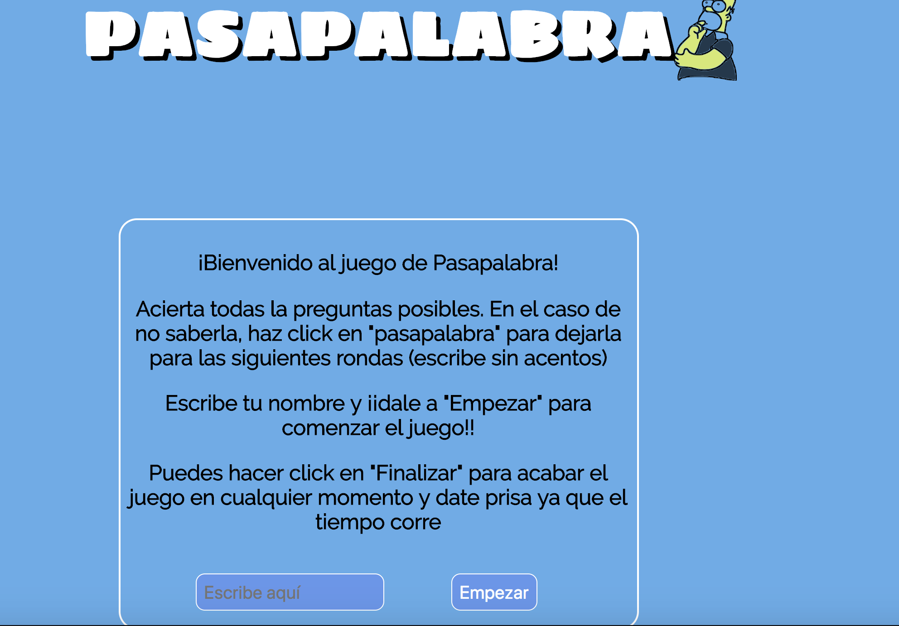

# pasapalabra

## Intrucciones
1. Anota tu nombre
2. Responde a las preguntas
3. Ver Ranking al finalizar el juego 
4. Clica en "volver a jugar" para probar otra vez

## Objetivos
Intenta responder todas las preguntas  en el menos tiempo posible.
En caso de no saberla, haz click en "Pasapalabra" para dejarla para la siguiente ronda.

Nota: Si quieres salir clica en "Finalizar"

## Imagen

##
https://eduberenguer.github.io/pasapalabra-skylab/